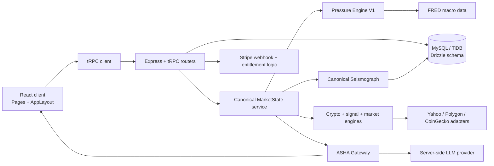
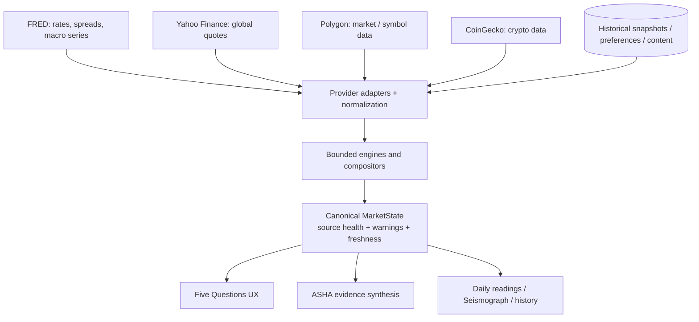
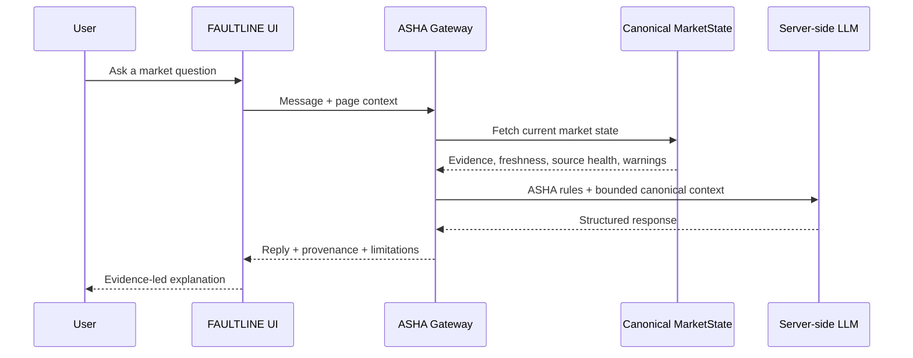
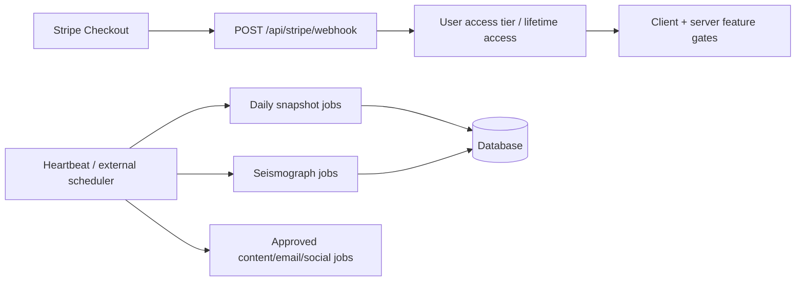

# FAULTLINE System Architecture

> **Architecture status:** This is a source-backed map of the current application. It distinguishes executable systems from provider-dependent, fallback, and future-facing elements. It does not claim that a live provider is available unless the running application reports it as healthy.

## 1. Operating-system model

FAULTLINE is a market-intelligence operating system organized around the **Five Questions** user experience: what is happening, why it is happening, what is most likely next, what to watch, and how to respond. The questions are coordinated by shared route/domain contracts in `shared/routeRegistry.ts`, canonical market-state types in `shared/marketState.ts`, composition logic, and page-specific views.

The product is not a single prediction engine. It accepts live and delayed data, converts it into bounded model outputs, attaches freshness and source-health metadata, stores selected snapshots, then presents evidence, uncertainty, historical context, and decision-support paths. Market-level probabilities remain distinct from ticker-specific setups and should never be merged into a claim about an individual security.

## 2. Data ingress and provenance

The system uses provider adapters rather than allowing browser pages to access sensitive external credentials. Representative paths include `server/fredClient.ts`, `server/yahooProxy.ts`, `server/signalsProxy.ts`, `server/coingeckoProxy.ts`, and Stripe/Google/X integrations. Servers should return a structured freshness/status label so the client can distinguish **live**, **delayed**, **cached**, **stale**, **fallback**, **static**, and **unavailable** information.

No upstream quote or macro source should silently become a fully trusted value after a failure. The V1 Pressure Engine, for example, preserves a recent verified live snapshot briefly and then labels fallback/static inputs when a provider cannot supply current data.

## 3. Pressure Index and regime classification

The current canonical Pressure Index is implemented in `server/pressure/engine.ts`. It calculates six 0–100 stress vectors using bounded transformations of FRED-sourced inputs, then computes a weighted composite. The executable weights are Liquidity Stress 20%, Credit Contagion Risk 20%, Volatility Regime 15%, Macro Sensitivity 20%, Market Breadth 10%, and AI/Speculative Bubble 15%.

| Composite band | Qualitative level |
|---:|---|
| 0–24 | Low |
| 25–44 | Moderate |
| 45–64 | Elevated |
| 65–79 | High |
| 80–100 | Critical |

The AI/Speculative Bubble vector is explicitly source-labeled as a static model baseline adjusted by available rates/spread inputs; it is not a direct live market-cap feed. The V3-H model under `server/pressure/shadowEngine.ts` is a separate shadow evaluation system and must not be substituted for V1 user-facing output during its no-tuning evaluation period.

## 4. Seismograph and historical memory

The canonical Seismograph system is represented by `server/seismographCore.ts`, `server/seismographUnified.ts`, `server/seismographEngine.ts`, provider adapters, and persisted Seismograph tables. Its evidence contract supports macro pressure, regime classification, probability distribution, historical analog, transition signals, liquidity, credit stress, momentum, volatility, cross-market alignment, crypto cycle, breakdown/recovery, sentiment, and insider-flow evidence types.

Each evidence packet carries source, timestamp, type, signal state, strength, confidence, reading text, and optional sub-scores/metadata. The provider provenance contract explicitly represents FRED as live, fallback, or unavailable. A historical view is retrospective analysis; it must not claim FAULTLINE was deployed or warned users at a historical time.

## 5. Canonical MarketState and Five Questions

`server/marketStateService.ts` produces the canonical, server-generated state used by the Five Questions and ASHA. It binds current conditions, evidence families, outlook probabilities, developing conditions, action framing, historical memory, source health, cache state, freshness, and warnings into one structured context.

| Question | User-facing intent | System responsibility |
|---|---|---|
| **What** | What is happening now? | Explain current regime, pressure, and market condition without hiding data gaps. |
| **Why** | Why is it happening? | Show evidence families, drivers, consensus, and disagreement. |
| **Outlook** | What is most likely next? | Present scenario/probability framing, not a guarantee. |
| **Watch** | What could change the view? | Surface transitions, accelerants, divergences, and invalidation triggers. |
| **Act** | How should the user think about response? | Provide decision support, guardrails, and conditional paths rather than personal financial advice. |

The Intelligence Lab is the deeper evidence layer around these questions. It should expand understanding — Seismograph, Global Markets, Symbol Intelligence, Pre-Flight, scenario tooling, research, and historical analysis — without replacing the Five Questions architecture.

## 6. ASHA evidence synthesis

ASHA receives a bounded canonical MarketState context through `server/ashaGateway.ts`, rather than arbitrary client-provided market facts. The gateway includes current destination/page context, cache/freshness, source health, warnings, current state, evidence families, outlook, watch conditions, action framing, and history. It instructs the model not to invent missing values or claim a source/engine that is marked unavailable.

ASHA must distinguish confirmed facts, observations, historical relationships, model estimates, inferences, and scenarios. It should expose source limitations when material, include confidence and invalidation conditions, and never turn a market-level probability into a ticker-specific assurance.

## 7. Macro intelligence versus Symbol Intelligence

Macro intelligence answers **system-level** questions: regimes, liquidity, credit, rates, volatility, breadth proxies, historical context, and cross-asset behavior. Symbol Intelligence and Day Trade Intelligence answer **asset-level** questions: instrument price/technical data, catalyst/context, entry/invalidations, and setup-specific risk. The latter must use its own provider-health and data-status model.

> **Non-negotiable separation:** A market-level probability distribution can inform a symbol's context, but it cannot be presented as a direct probability that a particular ticker will rise, fall, or meet a price target. A ticker-specific signal must identify its own inputs, time horizon, and limitations.

## 8. Persistence, payments, and operations

Drizzle schema definitions provide persistence for users, account entitlements, positions/watchlists, content, analytics, snapshots, Seismograph history, social/conversation features, Stripe webhook records, promo, and shadow-model records. Stripe is integrated through server-side checkout/webhook code and minimal local identifiers/entitlement data. Scheduled job implementations exist in server modules but require an active scheduler/heartbeat layer to execute.

## 9. Boundaries and recovery rules

The architecture deliberately uses provider adapters, data-status flags, tests, and server-side secrets to keep information provenance visible. A recovery must preserve these boundaries. Do not migrate external provider keys into frontend code, do not replace unavailable data with unlabeled numbers, do not re-enable automated outbound posting/email without approval, and do not imply that a historical reconstruction was a live FAULTLINE warning.

For implementation detail, see `FAULTLINE_ENGINE_SPECIFICATIONS.md`; for rebuild order, see `FAULTLINE_MASTER_RESTORATION_GUIDE.md`.
