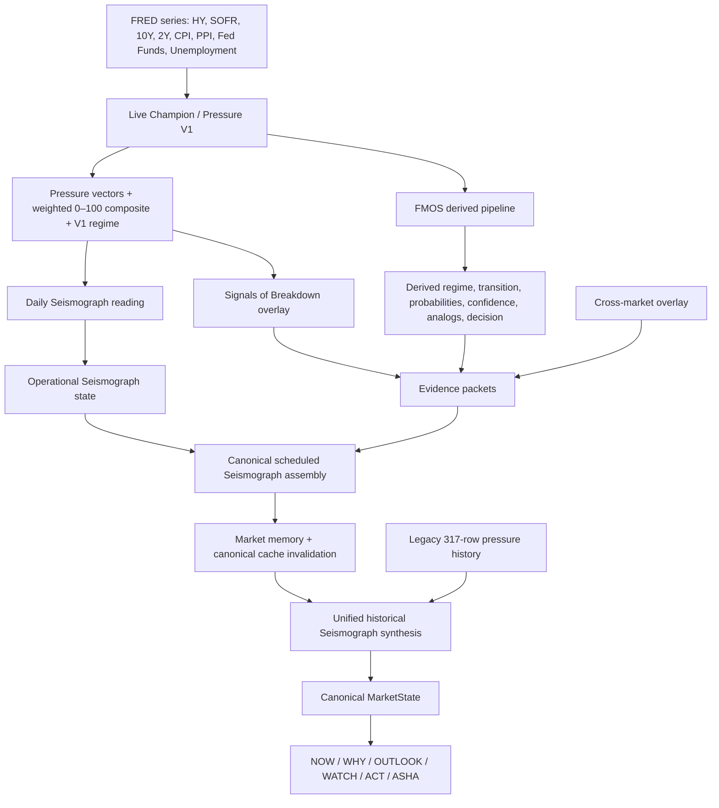

# Phase 1 — Algorithm Architecture Map

## Scope and Reading Rule

This map records **what the repository currently does**. It does not designate every output as a validated forecast, does not change the protected `f430a9ab` baseline, and does not merge live, legacy, verified, or reconstructed histories.

## Authoritative Dependency Chain

## What Is the Frozen Champion Core?

The live core is `calculateFaultlinePressure()` in `server/pressure/engine.ts`. It calculates six 0–100 vectors and a rounded weighted composite. It is the current implementation of the frozen Champion V1 mechanics used by the separate research program; historical research uses a separate service and does **not** inherit the live engine's missing-input fallbacks.

| Core vector | Weight | Inputs | Shared exposure |
|---|---:|---|---|
| Liquidity Stress | 20% | HY spread, SOFR | HY spread also enters Credit and AI; SOFR unique to this vector |
| Credit Contagion | 20% | HY spread, 10Y, unemployment | HY spread, 10Y, unemployment recur elsewhere |
| Volatility Regime | 15% | 10Y, 2Y, curve slope | 10Y recurs in Credit, Breadth, AI |
| Macro Sensitivity | 20% | CPI YoY, PPI YoY, Fed Funds | Distinct inflation/policy group |
| Market Breadth | 10% | unemployment, 10Y | Both inputs recur in Credit / Volatility / AI |
| AI / Speculative Bubble | 15% | static concentration baseline, 10Y, HY spread | Static baseline plus repeated rate/credit inputs |

The five regimes are exact: **LOW RISK** `<25`, **MODERATE RISK** `25–44`, **ELEVATED RISK** `45–64`, **HIGH STRESS** `65–79`, and **SYSTEMIC CRISIS** `80–100`.

## Five Domains / Ten Engines — Resolution

The phrase “five domains / ten engines” is **not a single executable architecture contract** in the current repository. The code establishes three overlapping vocabularies:

| Layer | Repository evidence | Audit classification |
|---|---|---|
| Champion V1 | Six weighted risk vectors | **Authoritative core score** |
| FMOS | Data acquisition; Market DNA; Weather; Regime; Transition; Evidence; Probability; Confidence; Historical Analogs; Decision; AI Interpretation | **Derived intelligence pipeline**; source comment calls it 13 upstream engines but lists 11 stages |
| Scheduled Seismograph | Core Pressure, FMOS, Cross-Market, SOB, evidence packets, operational state, assembly | **Canonical distributed current-state synthesis** |
| Unified Seismograph | Legacy historical table plus latest scheduled output | **Historical and explanatory consumer synthesis** |

Consequently, “domain,” “engine,” and “canonical” must be qualified by layer in any Phase 2 design. The live Champion composite is not a ten-engine score; the Seismograph output is not identical to Champion V1; and consumer-facing probabilities can originate from more than one derived layer.

## Current Canonical State and Synchronization Boundaries

`runSeismographPipeline()` runs `calculateFaultlinePressure()`, `runFMOSPipeline()`, and Cross-Market in parallel. FMOS independently calls `calculateFaultlinePressure()` again. The assembler then prefers FMOS pressure/regime/analogs when present while preserving the separately fetched core `pressureOutput` for other fields. This creates a real **same-run snapshot divergence boundary**: two live FRED reads can be performed, and the selected pressure/regime can come from a different engine invocation than the daily reading.

The scheduled Seismograph output is persisted to market memory. By contrast, `getUnifiedSeismographIntelligence()` queries the legacy `pressureHistory` series and supplements the most recent assembled output. `CanonicalMarketState` then maps Unified Seismograph without recomputing Champion. This is a consumer transformation with a retry and stale-if-error cache contract.

## History Tiers

| Dataset | Status | Correct use |
|---|---|---|
| `pressureHistory` (317 rows) | Immutable legacy historical research series | Legacy context only; not a reconstructed Champion calibration target |
| `verifiedHistoricalScores` (36 complete monthly scores) | Research-only, current retrievable coverage | Point-in-time-aware validation with source-quality limitations |
| `reconstructedHistoricalScores` (318 complete monthly scores; 2000-01 to 2026-07; 2018-03 incomplete) | Research-only reconstructed series | Retrospective formula evaluation only; no claim that FAULTLINE existed or warned at the time |
| Daily Seismograph readings | Forward-only operational observations | Persistence, trend, and future verified-event evidence; not historical backfill |

## Evidence Locations

| Topic | Primary repository evidence |
|---|---|
| Live core formula, weights, thresholds, source behavior | `server/pressure/engine.ts` |
| FMOS sequence and its independent Pressure invocation | `server/fmos/pipeline.ts` |
| Scheduled state orchestration and FMOS preferences | `server/scheduledSeismograph.ts` |
| Packet synthesis and distributed ASHA/brief payloads | `server/seismographCore.ts` |
| Daily trend, persistence, analog, transition, pattern logic | `server/seismographEngine.ts` |
| Legacy history synthesis and derived display probabilities | `server/seismographUnified.ts` |
| Consumer mapping and stale cache handling | `server/marketStateService.ts` |
